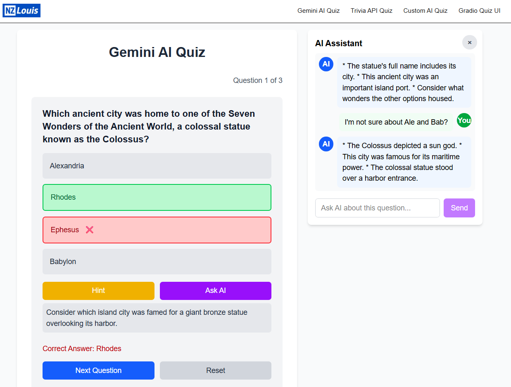

## nzlouis-ai-quiz

**AI-powered interactive quiz platform** built with Next.js. Supports multiple quiz flows (Gemini AI, Trivia API, Custom HF Space, Gradio UI), AI topic recommendations, and an AI assistant for hints. 

Built as a **showcase project** to demonstrate full-stack AI integration — ideal for remote-first teams in the US & Australia.

---

## Key Features

- **Multi-mode quiz generation**: Gemini AI Quiz, Trivia API Quiz, Custom AI Quiz (Hugging Face Space), Gradio Quiz UI.
- **AI-assisted UX**: Recommend Topic + AI Assistant for per-question reasoning.
- **Robust backend**: Next.js API routes normalize diverse AI/Space responses with debug metadata.
- **Production-ready stack**: Next.js App Router, TypeScript, Tailwind CSS, serverless APIs.
- **Deployable**: Ready for Vercel, supports public/private HF Spaces (HF token).

---

## Screenshots



👉 Live demo: [https://quiz.nzlouis.com](https://quiz.nzlouis.com/)

---

## Learn More

- [NZLouis website](https://www.nzlouis.com/) — more AI experiments & projects.

---

## Run Locally

```bash
npm install
# then
npm run dev
# or
yarn dev
# or
pnpm dev
# or
bun dev
```
